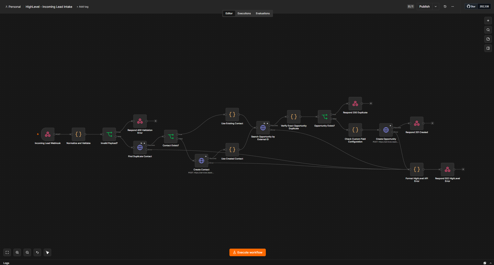
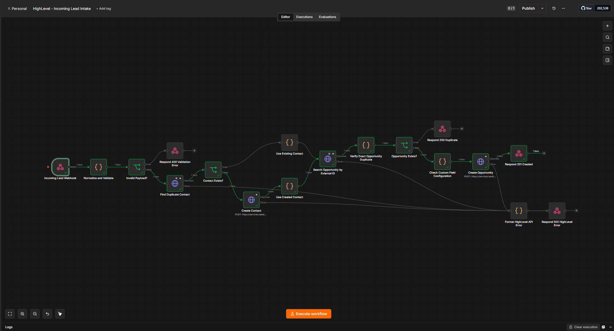
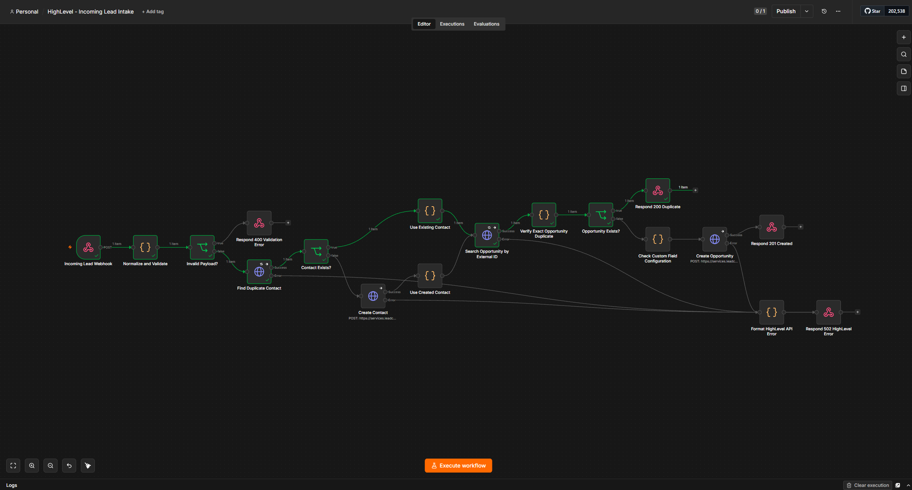
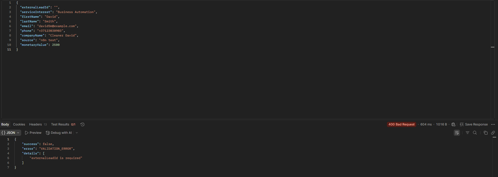
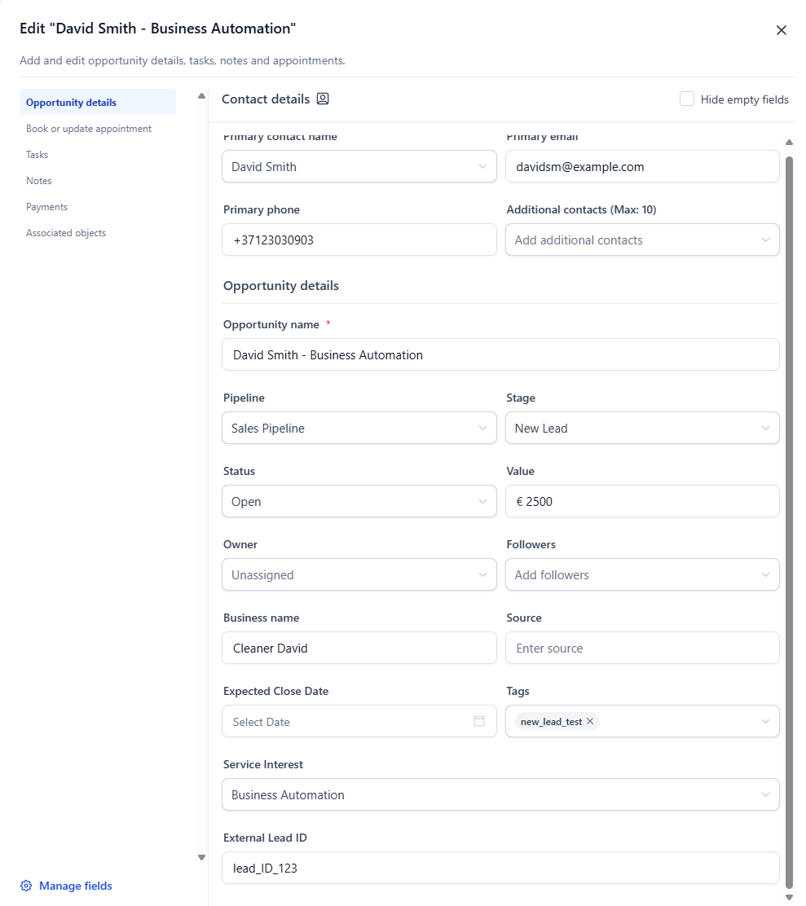

# HighLevel Lead Intake Automation

An n8n workflow that receives website leads through a webhook, validates and normalizes the payload, synchronizes contacts with HighLevel, prevents duplicate deals using an external lead ID, and returns clear HTTP responses to the caller.



## Business problem

Manual lead entry is slow and inconsistent. Repeated form submissions can also create duplicate contacts and opportunities, making pipeline reporting unreliable.

This automation provides a reusable intake layer between a website or lead source and HighLevel CRM:

- rejects incomplete or malformed requests before they reach the CRM;
- reuses an existing contact when email or phone already exists;
- creates a contact when no match exists;
- stores service interest and the source system's lead ID on the opportunity;
- prevents duplicate opportunities for the same external lead;
- returns machine-readable success and error responses.

## Workflow

```text
Webhook
  → Normalize and validate
  → Find contact
      → Existing contact
      → Create contact
  → Search the contact's opportunities
  → Match External Lead ID
      → Duplicate: return HTTP 200
      → New lead: create opportunity and return HTTP 201

HighLevel request failure
  → Format safe error response
  → Return HTTP 502
```

## Demonstrated scenarios

### New lead — HTTP 201

The workflow creates the contact and opportunity when both are new.



### Duplicate submission — HTTP 200

Repeated delivery of the same `externalLeadId` returns the existing opportunity instead of creating another one.



### Invalid payload — HTTP 400

Validation errors are returned before any HighLevel API request is made.



### CRM result

The opportunity is created in the configured pipeline and stage with its value, service interest, and external lead ID.



## Expected payload

```json
{
  "externalLeadId": "lead_demo_001",
  "serviceInterest": "Business Automation",
  "firstName": "Alex",
  "lastName": "Morgan",
  "email": "alex.morgan@example.com",
  "phone": "+37120000000",
  "companyName": "Example Company",
  "source": "Website form",
  "monetaryValue": 2500
}
```

Required fields:

- `externalLeadId`;
- `serviceInterest`;
- `name`, or `firstName`/`lastName`;
- at least one of `email` or `phone`.

## Responses

| Status | Meaning |
|---|---|
| `201` | A new opportunity was created |
| `200` | A duplicate external lead was found; no opportunity was created |
| `400` | Input validation failed |
| `502` | HighLevel returned an error or could not be reached |

## Reliability and safety

- Exact opportunity deduplication through a dedicated External Lead ID custom field.
- Contact lookup before creation.
- API Version header on every HighLevel request.
- Timeouts on external requests.
- Retries on safe search requests only; create requests are not retried automatically because they are not idempotent.
- Separate API error path with a sanitized response.
- Credentials are stored in n8n and are not included in the repository.
- The included workflow is disabled and contains placeholders instead of account-specific IDs.

## Repository contents

```text
workflows/   Sanitized importable n8n workflow
examples/    Valid, duplicate, and invalid request examples
docs/        Architecture, setup, testing, and security notes
screenshots/ Evidence from tested workflow executions
```

## Setup

See [docs/setup.md](docs/setup.md). Import the workflow from [workflows/highlevel-lead-intake.json](workflows/highlevel-lead-intake.json), configure the five HighLevel resource placeholders, and attach an n8n HTTP Header Auth credential.

## Documentation

- [Architecture](docs/architecture.md)
- [Setup](docs/setup.md)
- [Testing](docs/testing.md)
- [Security](docs/security.md)

## Scope

This repository is a portfolio-ready integration template, not a drop-in production deployment. Production use should add environment separation, centralized monitoring, persistent audit logging, webhook authentication, and requirements specific to the client's data-retention policy.

## License

MIT
